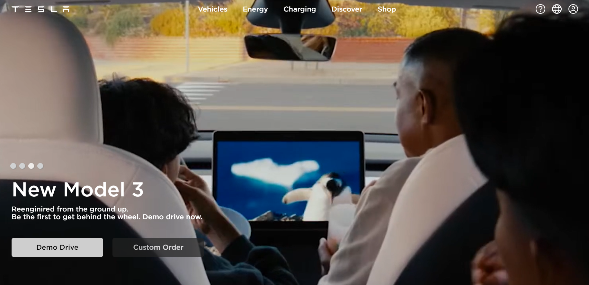
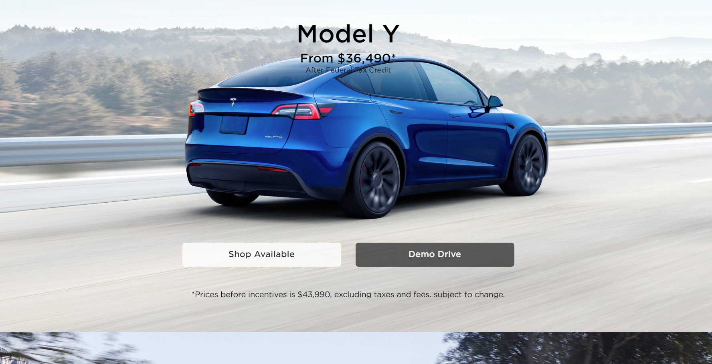

# Tesla-Project
The aim of this project was to make our work look like the first two parts 
of the Tesla website. We wanted it to feel just like you were browsing 
a real website.

## Table of Content
1. [About The Project.](#About-The-Project)
2. [Images.](#Images)
3. [Roadmap.](#Roadmap)
4. [Build With.](#Build-With)
5. [Link.](#Link)

### About The Project

The assignment was supposed to simulate the first two sections of the original Tesla website, 
the assignment was given as part of a Front-End BootCamp, as per writing those words, we 
have practiced HTML for almost 2 weeks and this week we have started CSS, the purpose 
was to make us understand basic website structure, and practice new skills we learned 
this week.

### Images

